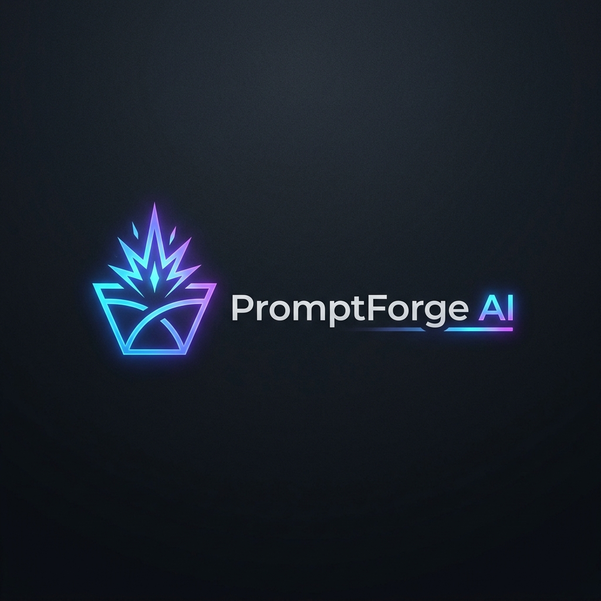
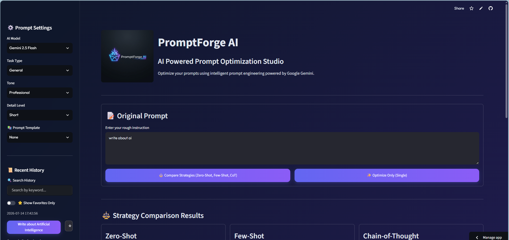
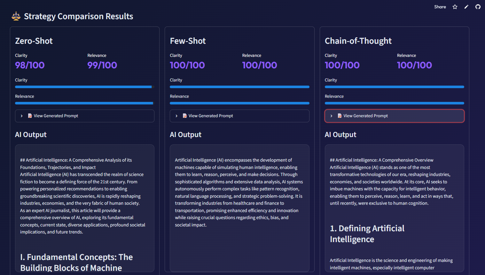

<div align="center">
  
  <h1>🚀 PromptForge AI</h1>
  <p><b>AI-Powered Prompt Optimization Studio</b></p>
  <p><i>Supercharge your prompt engineering with Google Gemini API & Streamlit</i></p>
</div>

---

## 📖 Overview

**PromptForge AI** is a professional-grade prompt engineering workspace. It takes your raw ideas and transforms them into highly effective, structured, and optimized prompts tailored to specific tasks and tones. Equipped with a **Prompt Quality Analyzer**, it not only optimizes your prompts but also teaches you how to write better ones by evaluating clarity, structure, and context.

<div align="center">
  
</div>

## ✨ Key Features

- ⭐ **AI Prompt Quality Analyzer**: Get instant scores on Clarity, Structure, Context, and Specificity, plus actionable AI suggestions.
- 📋 **One-click Copy Button**: Instantly copy your optimized prompts to your clipboard.
- 📄 **PDF & DOCX Export**: Download your optimized prompts in professional formats (TXT, PDF, DOCX).
- 🔍 **Advanced History (search + filter + favorites)**: Never lose a prompt again. Smart history saves automatically with instant refresh.
- 📊 **Prompt Comparison (Before vs After)**: A dedicated color-coded Diff viewer to see exactly what the AI changed.
- ⚙️ **Customization**: Configure Task Type, Tone, Detail Level, and use predefined Templates.

## 📸 Screenshots

<div align="center">
  
  
</div>

## 🛠️ Tech Stack

- **Frontend**: [Streamlit](https://streamlit.io/)
- **AI Model**: [Google Generative AI (Gemini)](https://ai.google.dev/)
- **Data Handling**: Pandas

## 🚀 Getting Started

### Prerequisites
Make sure you have Python installed. You will also need a Google Gemini API Key.

### Installation

1. **Clone the repository:**
   ```bash
   git clone https://github.com/your-username/PromptForge-AI.git
   cd PromptForge-AI
   ```

2. **Install dependencies:**
   ```bash
   pip install -r requirements.txt
   ```

3. **Environment Setup:**
   Create a `.env` file in the root directory and add your Gemini API Key:
   ```env
   GEMINI_API_KEY=your_api_key_here
   ```

4. **Run the Application:**
   ```bash
   streamlit run app.py
   ```

## 📂 Project Structure

```
PromptForge-AI/
├── app.py                 # Main Streamlit application
├── config.py              # Configuration & Environment loading
├── requirements.txt       # Python dependencies
├── assets/
│   └── style.css          # Custom styling
├── data/
│   └── prompt_history.csv # Local storage for history
└── src/
    ├── ai/
    │   └── gemini_client.py # Gemini API integration & Analyzer
    ├── core/
    │   ├── history.py       # History management (save, load, favorites)
    │   └── optimizer.py     # Prompt optimization logic
    └── utils.py             # Helper functions (CSS loader)
```

## 🤝 Contributing

Contributions, issues, and feature requests are welcome! Feel free to check the issues page if you want to contribute.

## 📝 License

This project is licensed under the MIT License - see the [LICENSE](LICENSE) file for details.
